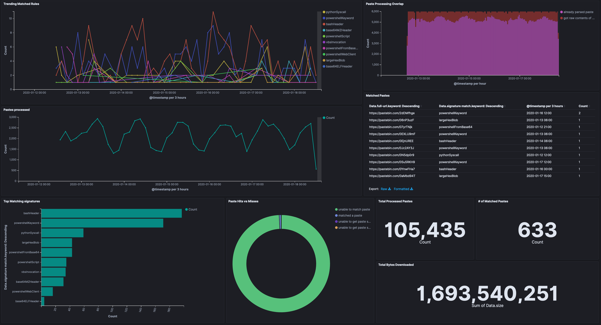

# pastescraper

A utility to scrape pastebin's incoming feed for known malware techniques.

You must have your ip whitelisted with pastebin for this to work.
[pastebin scraping docs](https://pastebin.com/doc_scraping_api)

## Usage

```go
// NOTE: This code does not check errors

c := &config{}
// fill in configuration info
err := c.getConf(configPath)

// load the requested parsers
parser, err := parse.New(c.Parsers)

// create the scraper with the loaded parsers
scraper, err := New(c, parser)

// start scraping
err = scraper.start(context.Background(), time.Second * 10)
```
## Getting Started

The easiest way to get started is to setup a local ELK instance with something like [this](https://github.com/deviantony/docker-elk), and fill in the following information for the configuration file. Of course, ELK is not required and can be run without. For recommended values, I would set maxqueuesize to 100.

```yaml
outputdir: "./pastes"
debug: False
maxqueuesize: 20
elastic:
  https: False
  username: ""
  password: ""
  host: ""
  port: 0
  index: ""
parsers: ["base64MZHeader", "base64ELFHeader", "powershellKeyword", "powershellScript", "powershellWebClient", "pythonSyscall", "bashHeader", "vbsInvocation", "powershellFromBase64"]

```

Once the ELK stack is setup and the fields are filled in, running `./pastescraper` should start parsing.

## Screenshots

